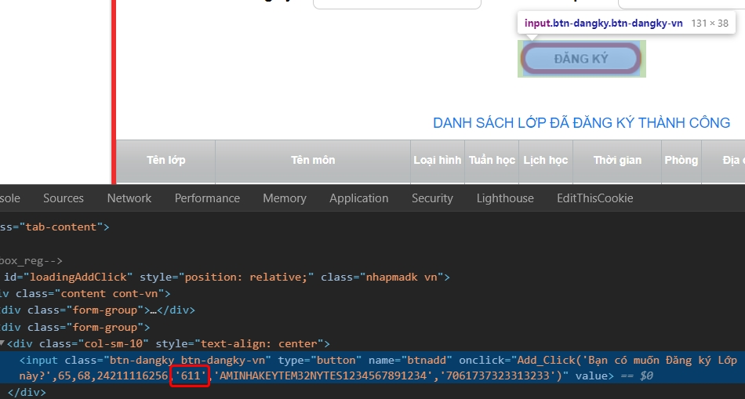
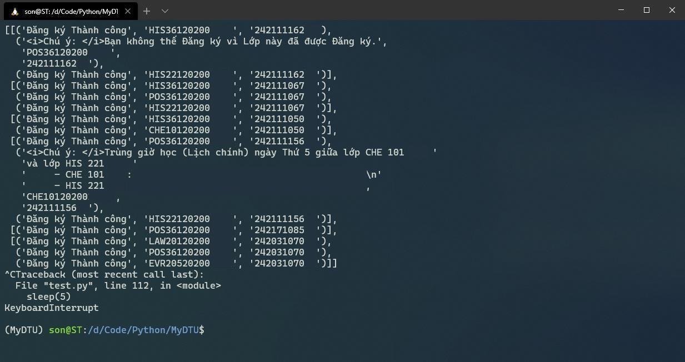

# MyDTU - Đăng Kí Tín Chỉ

*This note is not for someone who do not know anything about Information Technology and Programming.*

*...and sorry for my Engrisk*. :cry:

------

## Prerequisite

* Python >= 3.7

* OS: Windows, Linux and MacOS (recommend Linux and MacOS for the best ex,periences).

## How to use

You need to know this code snippet:

```python
addAccount(
    sessionId='sqydqiq1bptgoklmhw1timms',
    classRegCodes=['ABC123456789012', 'DEF123456789012', 'GHI123456789012'],
    studentIdNumber='24123456789',
    curriculumId='611',
    captcha='3976'
)
```

I won't go detail how this code works but the use. You need to find out how the codebase works by yourself.

* **sessionId**: This is a `ASP.NET_SessionId` cookie in MyDTU. You need to install [EditThisCookie](https://chrome.google.com/webstore/detail/editthiscookie/fngmhnnpilhplaeedifhccceomclgfbg) to get it.

* **classRegCodes**: the class's codes.

* **studentIdNumber**: the student ID number.

* **curriculumId**: To get this, you need to inspect the *Đăng ký* button in the register class form. The number after the student ID number is the one.

  

* **captcha**: This is a special thing in the whole process of register. You need to load the captcha once at first, enter the captcha value in the code and you can reuse it in every requests then.

  :warning: **Note**: You **SHOULD NOT** refresh the register class form, otherwise the new captcha will reload and you need to replace the captcha in the code with the new one.

### Run

This code is simple, just run this command:
```
$ python main.py
```
and It's works!



## Last words

* This repository is for educational-purpose only. :heart: